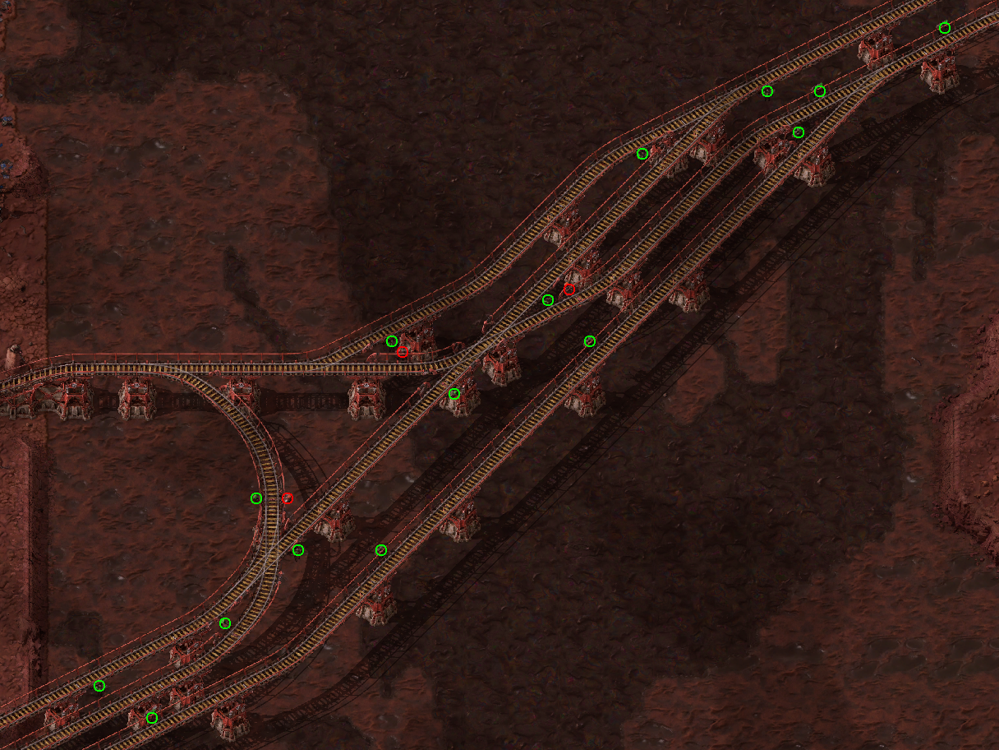

# Rail Signal Highlighter

Sometimes it can be hard to keep track of where all your rail signals are, especially when they are hidden behind trees or clustered around dense rail bridges. 

This mod improves visibility by **highlighting rail signals and their directions** whenever **Alt-Mode** is active and you are holding any railway-related item in your hand.

---

## Preview

---

## Features

* **Smart Toggling:** Visual highlights automatically appear when you hold rails, signals, or locomotives, and clean up instantly when you put them away.
* **Directional Indicators:** Easily see which way a signal is facing at a glance.
* **High Visibility:** Spots signals hidden behind trees, power poles, or complex rail infrastructure.

by teemu https://mods.factorio.com/mod/highlight-rail-signals